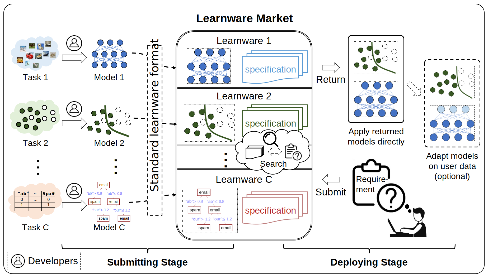
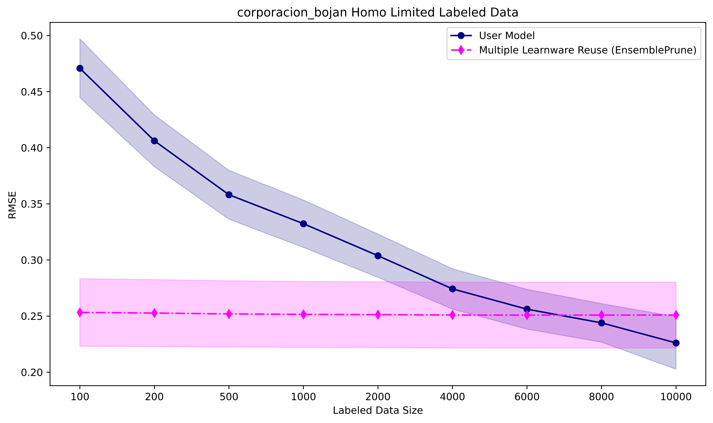
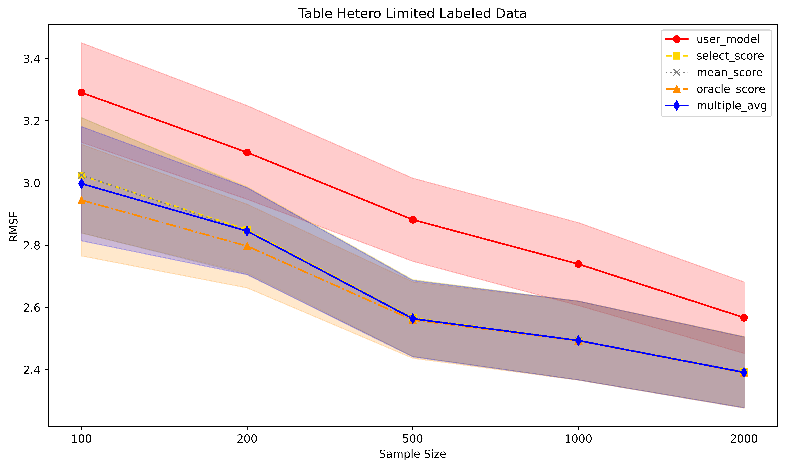
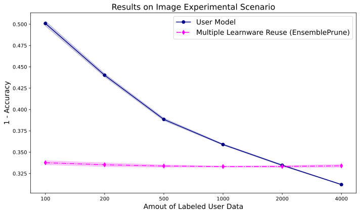
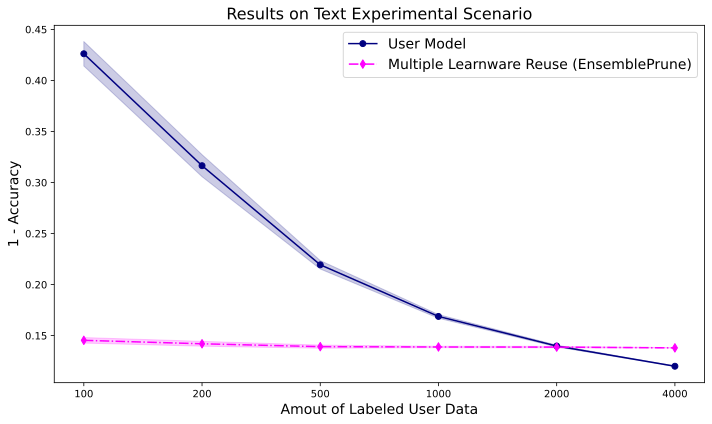

<div align=center>
  
  <br/>
  <br/>
</div>

<p align="center">
    <a href="https://pypi.org/project/learnware/#files">
        
    </a>
    <a href="https://pypi.org/project/learnware/#files">
        
    </a>
    <a href="https://github.com/Learnware-LAMDA/Learnware/actions">
        
    </a>
    <a href="https://pypi.org/project/learnware/#history">
        
    </a>
    <a href="https://learnware.readthedocs.io/en/latest/?badge=latest">
        
    </a>
    <a href="https://github.com/Learnware-LAMDA/Learnware/blob/main/LICENSE">
        
    </a>
</p>

<h3 align="center">
    <p>
        <b>English</b> |
        <a href="https://github.com/Learnware-LAMDA/Learnware/blob/main/README_zh.md">中文</a>
    </p>
</h3>

# Introduction

The _learnware_ paradigm, proposed by Professor Zhi-Hua Zhou in 2016 [1, 2], aims to build a vast model platform system, i.e., a _learnware dock system_, which systematically accommodates and organizes models shared by machine learning developers worldwide, and can efficiently identify and assemble existing helpful model(s) to solve future tasks in a unified way.

The `learnware` package provides a fundamental implementation of the central concepts and procedures within the learnware paradigm. Its well-structured design ensures high scalability and facilitates the seamless integration of additional features and techniques in the future.

In addition, the `learnware` package serves as the engine for the [Beimingwu System](https://bmwu.cloud) and can be effectively employed for conducting experiments related to learnware.

[1] Zhi-Hua Zhou. Learnware: on the future of machine learning. _Frontiers of Computer Science_, 2016, 10(4): 589–590 <br/>
[2] Zhi-Hua Zhou. Machine Learning: Development and Future. _Communications of CCF_, 2017, vol.13, no.1 (2016 CNCC keynote)

## Learnware Paradigm

A learnware consists of a high-performance machine learning model and specifications that characterize the model, i.e., "Learnware = Model + Specification".
These specifications, encompassing both semantic and statistical aspects, detail the model's functionality and statistical information, making it easier for future users to identify and reuse these models.

The need for Learnware arises due to challenges in machine learning, such as the need for extensive training data, advanced techniques, continuous learning, catastrophic forgetting, and data privacy issues. Although there are many efforts focusing on one of these issues separately, they are entangled, and solving one problem may exacerbate others. The learnware paradigm aims to address many of these challenges through a unified framework. Its benefits are listed as follows.

|  Benefit | Description  |
|  ----  | ----  |
| Lack of training data  | Strong models can be built with small data by adapting well-performed learnwares. |
| Lack of training skills | Ordinary users can obtain strong models by leveraging well-performed learnwares instead of building models from scratch. |
| Catastrophic forgetting  | Accepted learnwares are always stored in the learnware market, retaining old knowledge. |
| Continual learning | The learnware market continually enriches its knowledge with constant submissions of well-performed learnwares. |
| Data privacy/ proprietary | Developers only submit models, not data, preserving data privacy/proprietary. |
| Unplanned tasks | Open to all legal developers, the learnware market can accommodate helpful learnwares for various tasks. |
| Carbon emission | Assembling small models may offer good-enough performance, reducing interest in training large models and the carbon footprint. |

The learnware paradigm consists of two distinct stages:
- `Submitting Stage`: Developers voluntarily submit various learnwares to the learnware market, and the system conducts quality checks and further organization of these learnwares.
- `Deploying Stage`: When users submit task requirements, the learnware market automatically selects whether to recommend a single learnware or a combination of multiple learnwares and provides efficient deployment methods. Whether it’s a single learnware or a combination of multiple learnwares, the system offers convenient learnware reuse interfaces.

<div align="center">
  
</div>

## Learnware Package Design 

<div align="center">
  
</div>


At the workflow level, the `learnware` package consists of `Submitting Stage` and `Deploying Stage`.
At the module level, the `learnware` package is a platform that consists of above components. The components are designed as loose-coupled modules and each component could be used stand-alone.

# Quick Start

## Installation

Learnware is currently hosted on [PyPI](https://pypi.org/project/learnware/). You can easily install `learnware` by following these steps:

```bash
pip install learnware
```

In the `learnware` package, besides the base classes, many core functionalities such as "learnware specification generation" and "learnware deployment" rely on the `torch` library. Users have the option to manually install `torch`, or they can directly use the following command to install the `learnware` package:

```bash
pip install learnware[full]
```

**Note:** However, it's crucial to note that due to the potential complexity of the user's local environment, installing `learnware[full]` does not guarantee that `torch` will successfully invoke `CUDA` in the user's local setting.

## Prepare Learnware

In the `learnware` package, each learnware is encapsulated in a `zip` package, which should contain at least the following four files:

- `learnware.yaml`: learnware configuration file.
- `__init__.py`: methods for using the model.
- `stat.json`: the statistical specification of the learnware. Its filename can be customized and recorded in learnware.yaml.
- `environment.yaml` or `requirements.txt`: specifies the environment for the model.

To facilitate the construction of a learnware, we provide a [Learnware Template](https://www.bmwu.cloud/static/learnware-template.zip) that users can use as a basis for building their own learnware. We've also detailed the format of the learnware `zip` package in [Learnware Preparation](docs/workflows/upload:prepare-learnware).

## Learnware Package Workflow

Users can start a `learnware` workflow according to the following steps:

### Initialize a Learnware Market

The `EasyMarket` class provides the core functions of a `Learnware Market`. You can initialize a basic `Learnware Market` named "demo" using the code snippet below:

```python
from learnware.market import instantiate_learnware_market

# instantiate a demo market
demo_market = instantiate_learnware_market(market_id="demo", name="easy", rebuild=True)
```

### Upload Learnware

Before uploading your learnware to the `Learnware Market`, you'll need to create a semantic specification, `semantic_spec`. This involves selecting or inputting values for predefined semantic tags to describe the features of your task and model.

For instance, the following code illustrates the semantic specification for a Scikit-Learn type model. This model is tailored for education scenarios and performs classification tasks on tabular data:

```python
from learnware.specification import generate_semantic_spec

semantic_spec = generate_semantic_spec(
    name="demo_learnware",
    data_type="Table",
    task_type="Classification",
    library_type="Scikit-learn",
    scenarios="Education",
    license="MIT",
)
```

After defining the semantic specification, you can upload your learnware using a single line of code:

```python
demo_market.add_learnware(zip_path, semantic_spec)
```

Here, `zip_path` is the directory of your learnware `zip` package.

### Semantic Specification Search

To find learnwares that align with your task's purpose, you'll need to provide a semantic specification, `user_semantic`, that outlines your task's characteristics. The `Learnware Market` will then perform an initial search using `user_semantic`, identifying potentially useful learnwares with models that solve tasks similar to your requirements.

```python
# construct user_info, which includes a semantic specification
user_info = BaseUserInfo(id="user", semantic_spec=semantic_spec)

# search_learnware: performs semantic specification search when user_info doesn't include a statistical specification
search_result = easy_market.search_learnware(user_info) 
single_result = search_results.get_single_results()

# single_result: the List of Tuple[Score, Learnware] returned by semantic specification search
print(single_result)
```

### Statistical Specification Search

If you decide in favor of providing your own statistical specification file, `stat.json`, the `Learnware Market` can further refine the selection of learnwares from the previous step. This second-stage search leverages statistical information to identify one or more learnwares that are most likely to be beneficial for your task.

For example, the code below executes learnware search when using Reduced Set Kernel Embedding as the statistical specification:

```python
import learnware.specification as specification

user_spec = specification.RKMETableSpecification()

# unzip_path: directory for unzipped learnware zipfile
user_spec.load(os.path.join(unzip_path, "rkme.json"))
user_info = BaseUserInfo(
    semantic_spec=user_semantic, stat_info={"RKMETableSpecification": user_spec}
)
search_result = easy_market.search_learnware(user_info)

single_result = search_results.get_single_results()
multiple_result = search_results.get_multiple_results()

# search_item.score: based on MMD distances, sorted in descending order
# search_item.learnware.id: id of learnwares, sorted by scores in descending order
for search_item in single_result:
    print(f"score: {search_item.score}, learnware_id: {search_item.learnware.id}")

# mixture_item.learnwares: collection of learnwares whose combined use is beneficial
# mixture_item.score: score assigned to the combined set of learnwares in `mixture_item.learnwares`
for mixture_item in multiple_result:
    print(f"mixture_score: {mixture_item.score}\n")
    mixture_id = " ".join([learnware.id for learnware in mixture_item.learnwares])
    print(f"mixture_learnware: {mixture_id}\n")
```

### Reuse Learnwares

With the list of learnwares, `mixture_learnware_list`, returned from the previous step, you can readily apply them to make predictions on your own data, bypassing the need to train a model from scratch. We provide two methods for reusing a given list of learnwares: `JobSelectorReuser` and `AveragingReuser`. Substitute `test_x` in the code snippet below with your testing data, and you're all set to reuse learnwares:

```python
from learnware.reuse import JobSelectorReuser, AveragingReuser

# using jobselector reuser to reuse the searched learnwares to make prediction
reuse_job_selector = JobSelectorReuser(learnware_list=mixture_item.learnwares)
job_selector_predict_y = reuse_job_selector.predict(user_data=test_x)

# using averaging ensemble reuser to reuse the searched learnwares to make prediction
reuse_ensemble = AveragingReuser(learnware_list=mixture_item.learnwares)
ensemble_predict_y = reuse_ensemble.predict(user_data=test_x)
```

We also provide two methods when the user has labeled data for reusing a given list of learnwares: `EnsemblePruningReuser` and `FeatureAugmentReuser`. Substitute `test_x` in the code snippet below with your testing data, and substitute `train_X, train_y` with your training labeled data, and you're all set to reuse learnwares:

```python
from learnware.reuse import EnsemblePruningReuser, FeatureAugmentReuser

# Use ensemble pruning reuser to reuse the searched learnwares to make prediction
reuse_ensemble = EnsemblePruningReuser(learnware_list=mixture_item.learnwares, mode="classification")
reuse_ensemble.fit(train_X, train_y)
ensemble_pruning_predict_y = reuse_ensemble.predict(user_data=data_X)

# Use feature augment reuser to reuse the searched learnwares to make prediction
reuse_feature_augment = FeatureAugmentReuser(learnware_list=mixture_item.learnwares, mode="classification")
reuse_feature_augment.fit(train_X, train_y)
feature_augment_predict_y = reuse_feature_augment.predict(user_data=data_X)
```

### Auto Workflow Example

The `learnware` package also offers automated workflow examples. This includes preparing learnwares, uploading and deleting learnwares from the market, and searching for learnwares using both semantic and statistical specifications. To experience the basic workflow of the `learnware` package, the users can run `test/test_workflow/test_workflow.py` to try the basic workflow of `learnware`.

# Experiments and Examples

## Environment

For all experiments, we used a single Linux server. Details on the specifications are listed in the table below. All processors were used for training and evaluating.

<div align=center>

| System               | GPU                | CPU                      |
|----------------------|--------------------|--------------------------|
| Ubuntu 20.04.4 LTS   | Nvidia Tesla V100S | Intel(R) Xeon(R) Gold 6240R |

</div>

## Tabular Scenario Experiments

### Datasets

Our study involved three public datasets in the sales forecasting field: [Predict Future Sales (PFS)](https://www.kaggle.com/c/competitive-data-science-predict-future-sales/data), [M5 Forecasting (M5)](https://www.kaggle.com/competitions/m5-forecasting-accuracy/data), and [Corporacion](https://www.kaggle.com/competitions/favorita-grocery-sales-forecasting/data).

We applied various pre-processing methods to these datasets to enhance the richness of the data. After pre-processing, we first divided each dataset by store and then split the data for each store into training and test sets. Specifically:

- For PFS, the test set consisted of the last month's data from each store.
- For M5, we designated the final 28 days' data from each store as the test set.
- For Corporacion, the test set was composed of the last 16 days of data from each store.

In the submitting stage, the Corporacion dataset's 55 stores are regarded as 165 uploaders, each employing one of three different feature engineering methods. For the PFS dataset, 100 uploaders are established, each using one of two feature engineering approaches. These uploaders then utilize their respective stores' training data to develop LightGBM models. As a result, the learnware market comprises 265 learnwares, derived from five types of feature spaces and two types of label spaces.

Based on the specific design of user tasks, our experiments were primarily categorized into two types:

- **homogeneous experiments** are designed to evaluate performance when users can reuse learnwares in the learnware market that have the same feature space as their tasks (homogeneous learnwares). This contributes to showing the effectiveness of using learnwares that align closely with the user's specific requirements.

- **heterogeneous experiments** aim to evaluate the performance of identifying and reusing helpful heterogeneous learnwares in situations where no available learnwares match the feature space of the user's task. This helps to highlight the potential of learnwares for applications beyond their original purpose.

### Homogeneous Tabular Scenario

For homogeneous experiments, the 55 stores in the Corporacion dataset act as 55 users, each applying one feature engineering method, and using the test data from their respective store as user data. These users can then search for homogeneous learnwares in the market with the same feature spaces as their tasks.

The Mean Squared Error (MSE) of search and reuse across all users is presented in the table below:

<div align=center>

| Setting                           | MSE    |
|-----------------------------------|--------|
| Mean in Market (Single)           | 0.331  |
| Best in Market (Single)           | 0.151  |
| Top-1 Reuse (Single)              | 0.280  |
| Job Selector Reuse (Multiple)     | 0.274  |
| Average Ensemble Reuse (Multiple) | 0.267  |

</div>

When users have both test data and limited training data derived from their original data, reusing single or multiple searched learnwares from the market can often yield better results than training models from scratch on limited training data. We present the change curves in MSE for the user's self-trained model, as well as for the Feature Augmentation single learnware reuse method and the Ensemble Pruning multiple learnware reuse method. These curves display their performance on the user's test data as the amount of labeled training data increases. The average results across 55 users are depicted in the figure below:

<div align=center>
  
</div>

From the figure, it's evident that when users have limited training data, the performance of reusing single/multiple table learnwares is superior to that of the user's own model. This emphasizes the benefit of learnware reuse in significantly reducing the need for extensive training data and achieving enhanced results when available user training data is limited.

### Heterogeneous Tabular Scenario

In heterogeneous experiments, the learnware market would recommend helpful heterogeneous learnwares with different feature spaces with the user tasks. Based on whether there are learnwares in the market that handle tasks similar to the user's task, the experiments can be further subdivided into the following two types:

#### Cross Feature Space Experiments

We designate the 41 stores in the PFS dataset as users, creating their user data with an alternative feature engineering approach that varies from the methods employed by learnwares in the market. Consequently, while the market's learnwares from the PFS dataset undertake tasks very similar to our users, the feature spaces do not match exactly. In this experimental configuration, we tested various heterogeneous learnware reuse methods (without using user's labeled data) and compared them to the user's self-trained model based on a small amount of training data. The average MSE performance across 41 users is as follows:

<div align=center>

| Setting                           | MSE    |
|-----------------------------------|--------|
| Mean in Market (Single)           | 1.459  |
| Best in Market (Single)           | 1.226  |
| Top-1 Reuse (Single)              | 1.407  |
| Average Ensemble Reuse (Multiple) | 1.312  |
| User model with 50 labeled data   | 1.267  |

</div>

From the results, it is noticeable that the learnware market still performs quite well even when users lack labeled data, provided it includes learnwares addressing tasks that are similar but not identical to the user's. In these instances, the market's effectiveness can match or even rival scenarios where users have access to a limited quantity of labeled data.

#### Cross Task Experiments

Here we have chosen the 10 stores from the M5 dataset to act as users. Although the broad task of sales forecasting is similar to the tasks addressed by the learnwares in the market, there are no learnwares available that directly cater to the M5 sales forecasting requirements. All learnwares show variations in both feature and label spaces compared to the tasks of M5 users. We present the change curves in RMSE for the user's self-trained model and several learnware reuse methods. These curves display their performance on the user's test data as the amount of labeled training data increases. The average results across 10 users are depicted in the figure below:

<div align=center>
  
</div>

We can observe that heterogeneous learnwares are beneficial when there's a limited amount of the user's labeled training data available, aiding in better alignment with the user's specific task. This underscores the potential of learnwares to be applied to tasks beyond their original purpose.

## Image Scenario Experiment

For the CIFAR-10 dataset, we sampled the training set unevenly by category and constructed unbalanced training datasets for the 50 learnwares that contained only some of the categories. This makes it unlikely that there exists any learnware in the learnware market that can accurately handle all categories of data; only the learnware whose training data is closest to the data distribution of the target task is likely to perform well on the target task. Specifically, the probability of each category being sampled obeys a random multinomial distribution, with a non-zero probability of sampling on only 4 categories, and the sampling ratio is 0.4: 0.4: 0.1: 0.1. Ultimately, the training set for each learnware contains 12,000 samples covering the data of 4 categories in CIFAR-10.

We constructed 50 target tasks using data from the test set of CIFAR-10. Similar to constructing the training set for the learnwares, to allow for some variation between tasks, we sampled the test set unevenly. Specifically, the probability of each category being sampled obeys a random multinomial distribution, with non-zero sampling probability on 6 categories, and the sampling ratio is 0.3: 0.3: 0.1: 0.1: 0.1: 0.1. Ultimately, each target task contains 3000 samples covering the data of 6 categories in CIFAR-10.

With this experimental setup, we evaluated the performance of RKME Image using 1 - Accuracy as the loss.

<div align=center>

| Setting                           | Accuracy |
|-----------------------------------|----------|
| Mean in Market (Single)           | 0.655    |
| Best in Market (Single)           | 0.304    |
| Top-1 Reuse (Single)              | 0.406    |
| Job Selector Reuse (Multiple)     | 0.406    |
| Average Ensemble Reuse (Multiple) | 0.310    |

</div>

In some specific settings, the user will have a small number of labelled samples. In such settings, learning the weight of selected learnwares on a limited number of labelled samples can result in better performance than training directly on a limited number of labelled samples.

<div align=center>
  
</div>

## Text Scenario Experiment

### Datasets

We conducted experiments on the widely used text benchmark dataset: [20-newsgroup](http://qwone.com/~jason/20Newsgroups/). 20-newsgroup is a renowned text classification benchmark with a hierarchical structure, featuring 5 superclasses {comp, rec, sci, talk, misc}.

In the submitting stage, we enumerated all combinations of three superclasses from the five available, randomly sampling 50% of each combination from the training set to create datasets for 50 uploaders.

In the deploying stage, we considered all combinations of two superclasses out of the five, selecting all data for each combination from the testing set as a test dataset for one user. This resulted in 10 users. The user's own training data was generated using the same sampling procedure as the user test data, despite originating from the training dataset.

Model training comprised two parts: the first part involved training a tfidf feature extractor, and the second part used the extracted text feature vectors to train a naive Bayes classifier.

Our experiments comprise two components:

- **unlabeled_text_example** is designed to evaluate performance when users possess only testing data, searching and reusing learnware available in the market.
- **labeled_text_example** aims to assess performance when users have both testing and limited training data, searching and reusing learnware directly from the market instead of training a model from scratch. This helps determine the amount of training data saved for the user.

### Results

- **unlabeled_text_example**:

The table below presents the mean accuracy of search and reuse across all users:

<div align=center>

| Setting                           | Accuracy |
|-----------------------------------|----------|
| Mean in Market (Single)           | 0.507    |
| Best in Market (Single)           | 0.859    |
| Top-1 Reuse (Single)              | 0.846    |
| Job Selector Reuse (Multiple)     | 0.845    |
| Average Ensemble Reuse (Multiple) | 0.862    |

</div>

- **labeled_text_example**:

We present the change curves in classification error rates for both the user's self-trained model and the multiple learnware reuse (EnsemblePrune), showcasing their performance on the user's test data as the user's training data increases. The average results across 10 users are depicted below:

<div align=center>
  
</div>

From the figure above, it is evident that when the user's own training data is limited, the performance of multiple learnware reuse surpasses that of the user's own model. As the user's training data grows, it is expected that the user's model will eventually outperform the learnware reuse. This underscores the value of reusing learnware to significantly conserve training data and achieve superior performance when user training data is limited.

# About

## Contributors
We appreciate all contributions and thank all the contributors!

<div align=center>
  
</div>

## About us

Visit [LAMDA's official website](http://www.lamda.nju.edu.cn/).
