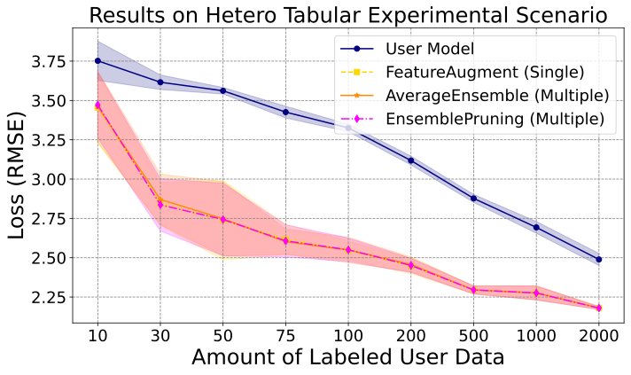
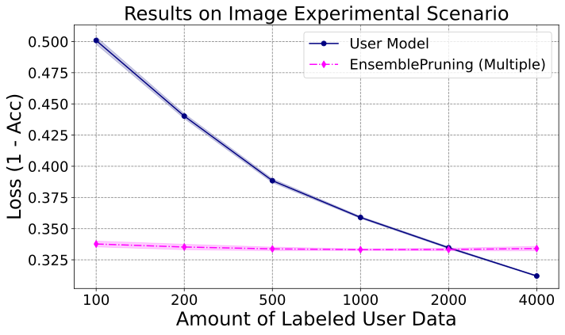
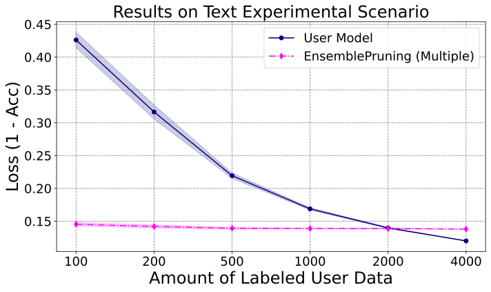

<div align=center>
  
  <br/>
  <br/>
</div>

<div align="center">
    <a href="https://pypi.org/project/learnware/#files">
        
    </a>
    <a href="https://pypi.org/project/learnware/#files">
        
    </a>
    <a href="https://pypi.org/project/learnware/#history">
        
    </a>
    <a href="https://img.shields.io/pypi/dm/example-package">
        
    </a>
    <a href="https://learnware.readthedocs.io/en/latest/?badge=latest">
        
    </a>
    <a href="LICENSE">
        
    </a>
</div>

<div>
    <h3 align="center">
        <b>中文</b> |
        <a href="README.md">English</a>
    </h3>
</div>

# 简介

学件由周志华教授在 2016 年提出 [1, 2]。在学件范式下，世界各地的开发者可分享模型至学件基座系统，系统通过有效查搜和复用学件帮助用户高效解决机器学习任务，而无需从零开始构建机器学习模型。

本项目开发的 `learnware` 包对学件范式中的核心组件和算法进行了实现，全流程地支持学件上传、检测、组织、查搜、部署和复用等功能。基于良好的结构设计，`learnware` 包具有高度可扩展性，为后续相关算法和功能的开发打下坚实基础。

此外，`learnware` 包被用于「[北冥坞系统](https://bmwu.cloud)」中，作为系统的核心引擎支撑整个系统的运转。科研人员也可以使用 `learnware` 包高效地探索学件相关研究。

[1] Zhi-Hua Zhou. Learnware: on the future of machine learning. Frontiers of Computer Science, 2016, 10(4): 589–590 <br/>
[2] 周志华. 机器学习: 发展与未来. 中国计算机学会通讯, 2017, vol.13, no.1 (2016 中国计算机大会 keynote)

## 学件范式

学件由性能优良的机器学习模型和描述模型的**规约**构成，即「学件 = 模型 + 规约」。学件的规约由「语义规约」和「统计规约」两部分组成：

- 语义规约通过文本对模型的类型及功能进行描述；
- 统计规约则通过各类机器学习技术，刻画模型所蕴含的统计信息。

学件的规约刻画了模型的能力，使得模型能够在未来用户事先对学件一无所知的情况下被充分识别并复用，以满足用户需求。

<div align="center">
  
</div>

如上图所示，在学件范式中，系统的工作流程主要分为以下两个阶段：

- **提交阶段**：开发者自发地提交各式各样的学件到学件基座系统，而系统会对这些学件进行质量检查和进一步的组织。
- **部署阶段**：当用户提交任务需求后，学件基座系统会根据学件规约推荐对用户任务有帮助的学件并指导用户进行部署和复用。

## 架构设计

<div align="center">
  
</div>

架构设计的原则包括：解耦 (Decoupling)、自治 (Autonomy)、可重用性 (Reusability) 以及可扩展性 (Scalability)。上图从模块和工作流程的角度对整个架构进行了阐述。

- 针对工作流程 (Workflow)，`learnware` 包括「提交阶段」和「部署阶段」。

<div align=center>

|  阶段 | 描述  |
|  ----  | ----  |
| 提交阶段  | 开发者将学件提交到学件市场中，随后市场会进行学件检测并对这些学件进行相应地组织。 |
| 部署阶段 | 学件市场根据用户的任务需求推荐学件，并提供统一的学件部署和复用的方法。 |

</div>

- 针对学件范式下各类模块 (Module)，`learnware` 是一个包含 `Learnware`, `Market`, `Specification`, `Model`, `Reuse` 和 `Interface` 等模块的平台。

<div align=center>

|  模块 | 描述  |
|  ----  | ----  |
| `Learnware`  | 学件由规约模块和模型模块组成。 |
| `Market` | 设计用于学件的组织、查搜和检测。 |
| `Specification` | 生成并存储学件的统计和语义规约，可用于学件的查搜和复用。 |
| `Model` | 包括模型和模型容器，可以提供统一的模型调用接口并自动创建隔离的模型运行环境。 |
| `Reuse` | 包括数据无关和数据相关的复用方式与异构学件对齐方式，可用于学件的部署和复用。 |
| `Interface` | 与北冥坞系统进行网络通讯的接口。|

</div>


# 快速上手

## 环境安装

`learnware` 包目前托管在 [PyPI](https://pypi.org/project/learnware/) 平台，其具体安装方式如下：

```bash
pip install learnware
```

在 `learnware` 包中，除了基础类之外，许多核心功能（如学件规约生成、学件部署等）都需要依赖 `torch` 库。用户可选择手动安装 `torch`，或直接采用以下命令安装 `learnware` 包：

```bash
pip install learnware[full]
```

但需要特别注意的是，由于用户本地环境可能较为复杂，安装 `learnware[full]` 并不能确保 `torch` 能够在用户的本地环境成功调用 `CUDA`。

## 学件准备

在 `learnware` 包中，每个学件都是一个 `zip` 包，其中至少需要包含以下四个文件：

- `learnware.yaml`：学件配置文件；
- `__init__.py`：提供使用模型的方法；
- `stat.json`：学件的统计规约，其文件名可自定义并记录在 learnware.yaml 中；
- `environment.yaml` 或 `requirements.txt`：指明模型的运行环境。

为方便大家构建学件，我们提供了「[学件模板](https://www.bmwu.cloud/static/learnware-template.zip)」，大家可在其基础上构建自己的学件。关于学件 `zip` 包中各文件的详细描述可参考文档：[学件准备](https://learnware.readthedocs.io/en/latest/workflows/upload.html#prepare-learnware)。

## 工作流程

用户可根据以下步骤实现 `learnware` 中的工作流程。

### 初始化学件市场

`EasyMarket` 类提供了学件市场的核心功能。根据如下代码，可以实例化一个名为 "demo" 的基础学件市场：

```python
from learnware.market import instantiate_learnware_market

# 实例化学件市场
demo_market = instantiate_learnware_market(market_id="demo", name="easy", rebuild=True)
```

### 上传学件

在将学件上传到「学件市场」之前，首先需要创建相应的语义规约 `semantic_spec`。这一过程包括选择或输入预定义的语义标签的值，以描述你的任务和模型的特性。

例如，以下代码示例生成了适用于教育场景的 `Scikit-Learn` 类型模型的语义规约。该模型用于对表格数据执行分类任务：

```python
from learnware.specification import generate_semantic_spec

semantic_spec = generate_semantic_spec(
    name="demo_learnware",
    data_type="Table",
    task_type="Classification",
    library_type="Scikit-learn",
    scenarios="Education",
    license="MIT",
)
```

得到语义规约后，可以使用如下代码上传学件：

```python
demo_market.add_learnware(zip_path, semantic_spec)
```

其中 `zip_path` 为待上传学件 `zip` 包的路径。

### 语义规约查搜

为了匹配适合你的任务目标的学件，你需要提供一个名为 `user_semantic` 的语义规约，来描述你的任务特性。随后，学件市场将通过 `user_semantic` 进行语义查搜，识别与你的任务需求相近的学件。

```python
# 构造包含语义规约的 user_info
user_info = BaseUserInfo(id="user", semantic_spec=semantic_spec)

# search_learnware: 当 user_info 不包含统计规约时，仅执行语义规约查搜
search_result = demo_market.search_learnware(user_info)
single_result = search_results.get_single_results()

# single_result: 语义规约查搜返回的 Tuple[Score, Learnware] 列表
print(single_result)
```

### 统计规约查搜

如果提供统计规约文件 `stat.json`，学件市场可以在语义规约查搜之外、利用统计信息来为你进一步匹配和推荐模型。这些模型往往具有更好的针对性。

以下代码展示了使用 Reduced Kernel Mean Embedding (RKME) 作为统计规约进行查搜的例子：

```python
import learnware.specification as specification

user_spec = specification.RKMETableSpecification()

# unzip_path: 解压缩的学件文件夹路径
user_spec.load(os.path.join(unzip_path, "rkme.json"))
user_info = BaseUserInfo(
    semantic_spec=user_semantic, stat_info={"RKMETableSpecification": user_spec}
)
search_result = demo_market.search_learnware(user_info)

single_result = search_results.get_single_results()
multiple_result = search_results.get_multiple_results()

# search_item.score: 根据 MMD 距离，按降序排列
# search_item.learnware.id: 学件 id, 根据查搜匹配度按降序排列
for search_item in single_result:
    print(f"score: {search_item.score}, learnware_id: {search_item.learnware.id}")

# mixture_item.learnwares: 可结合使用的学件集合
# mixture_item.score: `mixture_item.learnwares` 中各学件集合的查搜匹配度
for mixture_item in multiple_result:
    print(f"mixture_score: {mixture_item.score}\n")
    mixture_id = " ".join([learnware.id for learnware in mixture_item.learnwares])
    print(f"mixture_learnware: {mixture_id}\n")
```

### 多学件复用

我们提供了两种数据无关的方法来重用学件集合：`JobSelectorReuser` 和 `AveragingReuser`。将以下代码片段中的 `test_x` 替换为你的测试数据，即可实现学件复用：

```python
from learnware.reuse import JobSelectorReuser, AveragingReuser

# 使用 job selector reuser 复用查搜到的学件, 并对 text_x 进行预测
reuse_job_selector = JobSelectorReuser(learnware_list=mixture_item.learnwares)
job_selector_predict_y = reuse_job_selector.predict(user_data=test_x)

# 使用 averaging ensemble reuser 复用查搜到的学件, 并对 text_x 进行预测
reuse_ensemble = AveragingReuser(learnware_list=mixture_item.learnwares)
ensemble_predict_y = reuse_ensemble.predict(user_data=test_x)
```

我们还提供了两种数据相关的方法，`EnsemblePruningReuser` 和 `FeatureAugmentReuser`，可基于用户的有标记数据复用指定的学件集合。以下代码展示了如何使用这些方法来处理分类任务，其中 `test_x` 是测试数据，`train_x, train_y`为有标记的训练数据：

```python
from learnware.reuse import EnsemblePruningReuser, FeatureAugmentReuser

# 使用 ensemble pruning reuser 复用查搜到的学件, 并对 text_x 进行预测
# (train_x, train_y) 是有标记的训练数据
# `mode` 提供两种模式 "classification" 和 "regression"
reuse_ensemble = EnsemblePruningReuser(learnware_list=mixture_item.learnwares, mode="classification")
reuse_ensemble.fit(train_x, train_y)
ensemble_pruning_predict_y = reuse_ensemble.predict(user_data=test_x)

# 使用 feature augment reuser 复用查搜到的学件, 并对 text_x 进行预测
reuse_feature_augment = FeatureAugmentReuser(learnware_list=mixture_item.learnwares, mode="classification")
reuse_feature_augment.fit(train_x, train_y)
feature_augment_predict_y = reuse_feature_augment.predict(user_data=test_x)
```

### 自动工作流程示例

`learnware` 包提供了自动化的工作流程示例，包括准备学件、在学件市场中上传和删除学件，以及使用语义和统计规约查搜学件。工作流程示例可参考 `test/test_workflow/test_workflow.py` 文件。

# 实验示例

我们构建了各种类型的实验场景，并进行了充分的测试，以评估规约生成、学件查搜以及在表格、图像和文本数据上学件复用的基线算法。

## 实验配置

所有实验均在一台 Linux 服务器上完成，其具体规格如下表所示。服务器的所有处理器均用于训练和评估。

<div align=center>

| 系统               | GPU                | CPU                      |
|----------------------|--------------------|--------------------------|
| Ubuntu 20.04.4 LTS   | Nvidia Tesla V100S | Intel(R) Xeon(R) Gold 6240R |

</div>

## 表格场景实验

在各种表格数据集上，我们首先评估了从学件市场中识别和复用与用户任务具有相同特征空间的学件的性能。鉴于表格任务通常来自异构的特征空间，我们也对从不同特征空间中识别和复用学件的性能进行了评估。

### 实验设置

我们的实验使用了三个公开的销量预测数据集：[Predict Future Sales (PFS)](https://www.kaggle.com/c/competitive-data-science-predict-future-sales/data)，[M5 Forecasting (M5)](https://www.kaggle.com/competitions/m5-forecasting-accuracy/data) 和 [Corporacion](https://www.kaggle.com/competitions/favorita-grocery-sales-forecasting/data)。为了增加实验的多样性，我们对这些数据集应用了多种特征工程方法。接着，我们将每个数据集按店铺划分，并将每个店铺的数据进一步划分为训练集和测试集。我们在 Corporacion 和 PFS 的每个训练集上训练了 LightGBM 模型，同时使用相应的测试集和 M5 数据集构建用户任务。基于这些实验设置，我们构建了一个包含 265 个学件的学件市场，覆盖了五种不同的特征空间和两种标记空间。所有这些学件都已上传至[北冥坞学件基座系统](https://bmwu.cloud/)。

### 基线算法

最基础的学件复用方式是 Top-1 复用 (Top-1 reuser)，它直接使用根据 RKME 规约查搜得到的单个学件。此外，我们实现了两种数据无关的复用方法和两种数据相关的复方法，它们可用于复用从市场中识别出的单个或多个有用的学件。当用户无标记的数据时，JobSelectorReuser 通过训练一个任务选择器为不同的样本选择合适的学件；AverageEnsembleReuser 使用集成方法进行预测。在用户有测试数据和少量有标记训练数据的情况下，EnsemblePruningReuser 通过多目标演化算法挑选一组适合用户任务的学件，然后进行平均集成；FeatureAugmentReuser 将每个学件的预测输出视为新特征，并在增强后的特征集上构建一个简单模型。需要注意的是，JobSelectorReuser 和 FeatureAugmentReuser 只对表格数据有效，而其他方法也适用于文本和图像数据。

### 同构场景

在同构场景实验中，PFS 数据集中的 53 家商店被视为 53 个独立的用户。每个商店使用自己的测试数据作为用户数据，并采用与学件市场相同的特征工程方法。这些用户随后可以在市场内查搜与其任务具有相同特征空间的同构学件。

当用户没有标记的数据或只有少量有标记数据时，我们对不同的基线算法进行了比较。下表总结了所有用户的平均损失。结果表明，我们提供的方法优于从市场中随机选择学件的效果。

<div align=center>

| Setting                           | RMSE   |
|-----------------------------------|--------|
| Mean in Market (Single)           | 0.897  |
| Best in Market (Single)           | 0.756  |
| Top-1 Reuse (Single)              | 0.830  |
| Job Selector Reuse (Multiple)     | 0.848  |
| Average Ensemble Reuse (Multiple) | 0.816  |

</div>

我们还探索了用户提供不同数量标记数据的情况。对于每个用户，我们进行了多次实验，并记录了损失的均值和标准差。下图展示了所有用户上的平均损失曲线。实验结果显示，当用户只有有限的训练数据时，识别和复用单个或多个学件相比于用户自行训练的模型表现出更好的性能。

<div align=center>
  
</div>

### 异构场景

根据学件市场中学件与用户任务之间的相似性，异构场景的实验进一步分为两类：一类是特征空间异构但任务相同的情况，另一类则是任务本身不同的情况。

#### 不同特征工程的场景

我们将 PFS 数据集中的 41 家商店作为用户，采用与市场中学件不同的特征工程方法生成他们的用户数据。因此，尽管市场上的某些学件也是为 PFS 数据集设计的，但特征空间并不完全一致。

在这种实验设定下，我们主要关注数据无关复用方法的表现。下表中的结果表明，即使用户没有标记数据，通过复用市场中的学件也能取得良好的性能，特别是使用多学件复用方法 AverageEnsemble 时。

<div align=center>

| Setting                           | RMSE   |
|-----------------------------------|--------|
| Mean in Market (Single)           | 1.149  |
| Best in Market (Single)           | 1.038  |
| Top-1 Reuse (Single)              | 1.075  |
| Average Ensemble Reuse (Multiple) | 1.064  |

</div>


#### 不同的任务场景

我们对 M5 数据集的十家商店采用三种不同的特征工程方法，设定了 30 个用户任务。尽管市场上的学件都用于销量预测任务，但它们并非专门为 M5 数据集的销量预测任务设计。

下图展示了用户自行训练的模型与几种学件复用方法的损失曲线对比。结果显示，异构学件能通过有限的标记数据，有效适应特定用户任务。

<div align=center>
  
</div>


## 图像场景实验

接下来，我们对图像数据集进行了算法评估。由于图像尺寸的差异可以通过调整大小来标准化处理，因此不需要考虑特征异构的情况。

### 实验设置

我们选用了经典的 [CIFAR-10](https://www.cs.toronto.edu/~kriz/cifar.html) 图像分类数据集进行实验，该数据集包括 10 个类别的 60000 张 32x32 彩色图像。我们上传了 50 个学件，每个学件包含一个在不平衡子集上训练的卷积神经网络模型，这个子集由四个类别的 12000 个样本组成，其采样比例为 `0.4:0.4:0.1:0.1`。我们设定了 100 个用户任务，每个任务由 CIFAR-10 的 3,000 个样本组成，这些样本涵盖六个类别，采样比例为 `0.3:0.3:0.1:0.1:0.1:0.1`。

### 实验结果

我们使用 `1 - Accuracy` 作为损失度量来评估各种方法的平均性能。实验结果表明，在标记数据稀缺或仅有限数量（不超过 2000 个实例）的情况下，通过利用学件市场的资源，可以实现更优的性能表现。

<div align=center>

| Setting                           | Accuracy |
|-----------------------------------|----------|
| Mean in Market (Single)           | 0.655    |
| Best in Market (Single)           | 0.304    |
| Top-1 Reuse (Single)              | 0.406    |
| Job Selector Reuse (Multiple)     | 0.406    |
| Average Ensemble Reuse (Multiple) | 0.310    |

</div>

<div align=center>
  
</div>

## 文本场景实验

最后，我们在文本数据集上对我们的算法进行了评估。由于文本数据的特征天然异构，我们通过使用句子嵌入提取器（Sentence Embedding Extractor）来统一处理这一问题。

### 实验设置

我们在经典的文本分类数据集 [20-newsgroup](http://qwone.com/~jason/20Newsgroups/) 上进行了实验，该数据集包含约 20000 篇新闻文档，涵盖 20 个不同的新闻组。与图像实验类似，我们一共上传了 50 个学件。每个学件的模型组合了 tf-idf 特征提取器与朴素贝叶斯分类器，在一个样本子集上进行训练。这些样本子集仅包括三个超类中一半的样本数据。我们设置了 10 个用户任务，每个任务包括两个超类。


### 实验结果

结果如下表和图所示。同样地，即使没有提供标记数据，通过学件的识别和复用所达到的性能可以与市场上最佳学件相匹敌。此外，相比于从头训练模型，利用学件市场可以节省大约 2000 个样本。

<div align=center>

| Setting                           | Accuracy |
|-----------------------------------|----------|
| Mean in Market (Single)           | 0.507    |
| Best in Market (Single)           | 0.859    |
| Top-1 Reuse (Single)              | 0.846    |
| Job Selector Reuse (Multiple)     | 0.845    |
| Average Ensemble Reuse (Multiple) | 0.862    |

</div>


<div align=center>
  
</div>


# 引用

如果您在研究或工作中使用了我们的项目，请引用下述论文，感谢你的支持！

```bibtex
@article{zhou2024learnware,
  title = {Learnware: Small models do big},
  author = {Zhou, Zhi-Hua and Tan, Zhi-Hao},
  journal = {Science China Information Sciences},
  volume = {67},
  number = {1},
  pages = {112102},
  year = {2024}
}

@inproceedings{tan2024beimingwu,
  title = {Beimingwu: A Learnware Dock System},
  author = {Tan, Zhi-Hao and Liu, Jian-Dong and Bi, Xiao-Dong and Tan, Peng and Zheng, Qin-Cheng and Liu, Hai-Tian and Xie, Yi and Zou, Xiao-Chuan and Yu, Yang and Zhou, Zhi-Hua},
  booktitle = {Proceedings of the 30th ACM SIGKDD Conference on Knowledge Discovery and Data Mining (KDD)},
  pages = {5773--5782},
  year = {2024}
}
```

# 关于

## 如何贡献

`learnware` 还很年轻，可能存在错误和问题。我们非常欢迎大家为 `learnware` 做出贡献，研究和改进学件相关算法，或是围绕学件范式进行开发和探索。我们为所有的开发者提供了详细的[项目开发指南](https://learnware.readthedocs.io/en/latest/about/dev.html)，并设置了相应的 commit 格式和 pre-commit 配置，请大家遵守。非常感谢大家的参与和支持！

## 关于我们

`learnware` 由 LAMDA 北冥坞研发团队开发和维护，更多信息可参考：[团队简介](https://docs.bmwu.cloud/zh-CN/about-us.html)。
