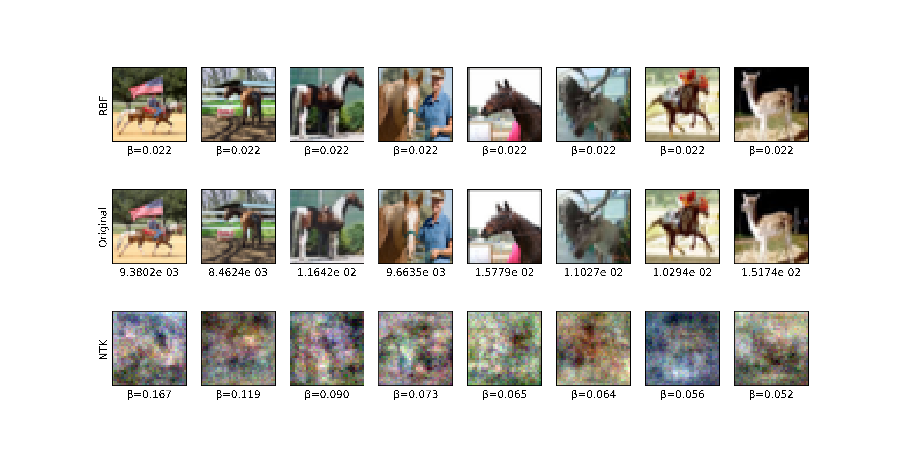

.. _spec:
================================
Specification
================================

Learnware specification is the central component of the learnware paradigm, linking all processes related to learnwares, including uploading, organizing, searching, deploying, and reusing. 

In this section, we will introduce the concept and design of learnware specification within the ``learnware`` package.
We will then explore ``regular specification``\ s covering data types including tables, images, and texts.
Lastly, we introduce a ``system specification`` specifically generated for tabular learnwares by the learnware doc system using its knowledge, enhancing learnware management and further characterizing their capabilities.

Concepts & Types
==================

The learnware specification describes the model's specialty and utility in a certain format, allowing the model to be identified and reused by future users who may have no prior knowledge of the learnware.
The ``learnware`` package employs a highly extensible specification design, which consists of two parts:

- **Semantic specification** describes the model's type and functionality through a set of descriptions and tags. Learnwares with similar semantic specifications reside in the same specification island
- **Statistical specification** characterizes the statistical information contained in the model using various machine learning techniques. It plays a crucial role in locating the appropriate place for the model within the specification island.

When searching in the learnware doc system, the system first locates specification islands based on the semantic specification of the user's task, 
then pinpoints potentially beneficial learnwares on these islands based on the statistical specification of the user's task.

Statistical Specification
---------------------------

We employ the ``Reduced Kernel Mean Embedding (RKME) Specification`` as the basis for implementing statistical specification for diverse data types, 
with adjustments made according to the characteristics of each data type. 
The RKME specification is a recent development in learnware specification design, which captures the data distribution while not disclosing the raw data .

There are two types of statistical specifications within the ``learnware`` package: ``regular specification`` and ``system specification``. The former is generated locally
by users to express their model's statistical information. In contrast, the latter is generated by the learnware doc system to enhance learnware management and further characterizing the learnwares' capabilities.

Semantic Specification
-----------------------

The semantic specification consists of a "dict" structure that includes keywords "Data", "Task", "Library", "Scenario", "License", "Description", and "Name". 
In the case of table learnwares, users should additionally provide descriptions for each feature dimension and output dimension through the "Input" and "Output" keywords.

- If "data_type" is "Table", you need to specify the semantics of each dimension of the model's input data for compatibility with tasks in heterogeneous feature spaces.
- If "task_type" is "Classification", you need to provide the semantics of model output labels (prediction labels start from 0) for use in classification tasks with heterogeneous output spaces.
- If "task_type" is "Regression", you need to specify the semantics of each dimension of the model output, making the uploaded learnware suitable for regression tasks with heterogeneous output spaces.

Regular Specification
======================================

The ``learnware`` package provides a unified interface, ``generate_stat_spec``, for generating ``regular specification``\ s across different data types. 
Users can use the training data ``train_x`` (supported types include numpy.ndarray, pandas.DataFrame, and torch.Tensor) as input to generate the ``regular specification`` of the model,
as shown in the following code:

.. code:: python

   for learnware.specification import generate_stat_spec

   data_type = "table" # supported data types: ["table", "image", "text"]
   regular_spec = generate_stat_spec(type=data_type, x=train_x)
   regular_spec.save("stat.json")

It is worth noting that the above code only runs on the user's local computer and does not interact with cloud servers or leak local raw data.

.. note:: 

   In cases where the model's training data is too large, causing the above code to fail, you can consider sampling the training data to ensure it's of a suitable size before proceeding with reduction generation.

Table Specification
--------------------------

``RKMETableSpecification`` implements the RKME specification, which is the basis of tabular learnwares. It facilitates learnware identification and reuse for homogeneous tasks with identical input and output domains.

Image Specification
--------------------------

Image data lives in a higher dimensional space than other data types. Unlike lower dimensional spaces, 
metrics defined based on Euclidean distances (or similar distances) will fail in higher dimensional spaces. 
This means that measuring the similarity between image samples becomes difficult. 

The specification for image data ``RKMEImageSpecification`` introduces a new kernel function that transforms images implicitly before RKME calculation. 
It employs the Neural Tangent Kernel (NTK) [1]_, a theoretical tool that characterizes the training dynamics of deep neural networks in the infinite width limit, to enhance the measurement of image similarity in high-dimensional spaces.

Usage & Example
^^^^^^^^^^^^^^^^^^^^^^^^^^

In this part, we show that how to generate Image Specification for the training set of the CIFAR-10 dataset. 
Note that the Image Specification is generated on a subset of the CIFAR-10 dataset with ``generate_rkme_image_spec``. 
Then, it is saved to file "cifar10.json" using ``spec.save``. 

In many cases, it is difficult to construct Image Specification on the full dataset. 
By randomly sampling a subset of the dataset, we can efficiently construct Image Specification based on it, with a strong enough statistical description of the full dataset.

.. tip::
   Typically, sampling 3,000 to 10,000 images is sufficient to generate the Image Specification.

.. code-block:: python

   import torchvision
   from torch.utils.data import DataLoader
   from learnware.specification import generate_rkme_image_spec

   cifar10 = torchvision.datasets.CIFAR10(
      root='./data', train=True, download=True, transform=torchvision.transforms.ToTensor()
   )
   X, _ = next(iter(DataLoader(cifar10, batch_size=len(cifar10))))

   spec = generate_rkme_image_spec(X, sample_size=5000)
   spec.save("cifar10.json")

Raw Data Protection
^^^^^^^^^^^^^^^^^^^^^^^^^^

In the third row of the figure, we show the eight pseudo-data with the largest weights :math:`\beta` in the ``RKMEImageSpecification`` generated on the CIFAR-10 dataset.
Notice that the ``RKMEImageSpecification`` generated based on Neural Tangent Kernel (NTK) doesn't compromise raw data security.

In contrast, we show the performance of the RBF kernel on image data in the first row of the figure below. 
The RBF not only exposes the original data (plotted in the corresponding position in the second row) but also fails to fully utilize the weights :math:`\beta`.

Text Specification
--------------------------

Different from tabular data, each text input is a string of different length, so we should first transform them to equal-length arrays. Sentence embedding is used here to complete this transformation. We choose the model ``paraphrase-multilingual-MiniLM-L12-v2``, a lightweight multilingual embedding model. Then, we calculate the RKME specification on the embedding,  just like we do with tabular data. Besides, we use the package ``langdetect`` to detect and store the language of the text inputs for further search. We hope to search for the learnware that supports the language of the user task.

System Specification
======================================

In addition to ``regular specification``\ s, the learnware doc system leverages its knowledge to generate new ``system specification``\ s for learnwares.
The ``system specification`` module is automatically generated by the doc system. For newly inserted learnwares, the ``organizer`` generates new system specifications based on existing learnware statistical specifications to facilitate search operations and expand the search scope.

Currently, the ``learnware`` package has implemented the ``HeteroMapTableSpecification`` which enables learnwares organized by the ``Hetero Market`` to support tasks with varying feature and prediction spaces.
This specification is derived by mapping the ``RKMETableSpecification`` to a unified semantic embedding space, utilizing the heterogenous engine which is a tabular network trained on feature semantics of all tabular learnwares.
Please refer to `COMPONENTS: Hetero Market  <../components/market.html#hetero-market>`_ for implementation details.

References
-----------

.. [1] Adrià Garriga-Alonso, Laurence Aitchison, and Carl Edward Rasmussen. Deep convolutional networks as shallow gaussian processes. In: *International Conference on Learning Representations (ICLR'19)*, 2019.