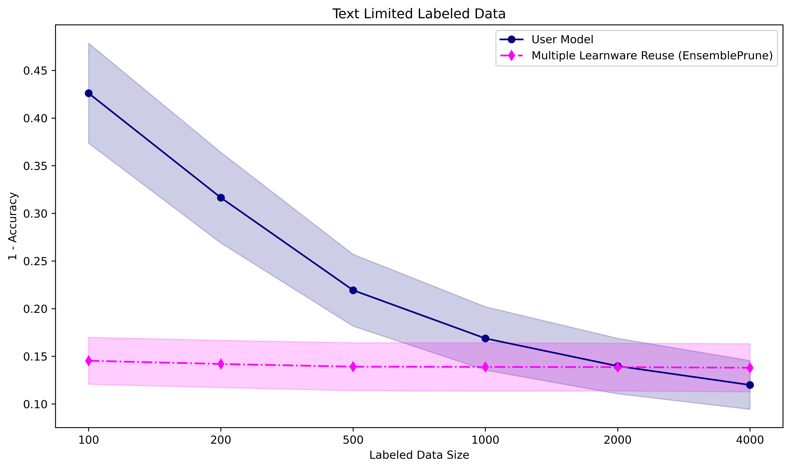
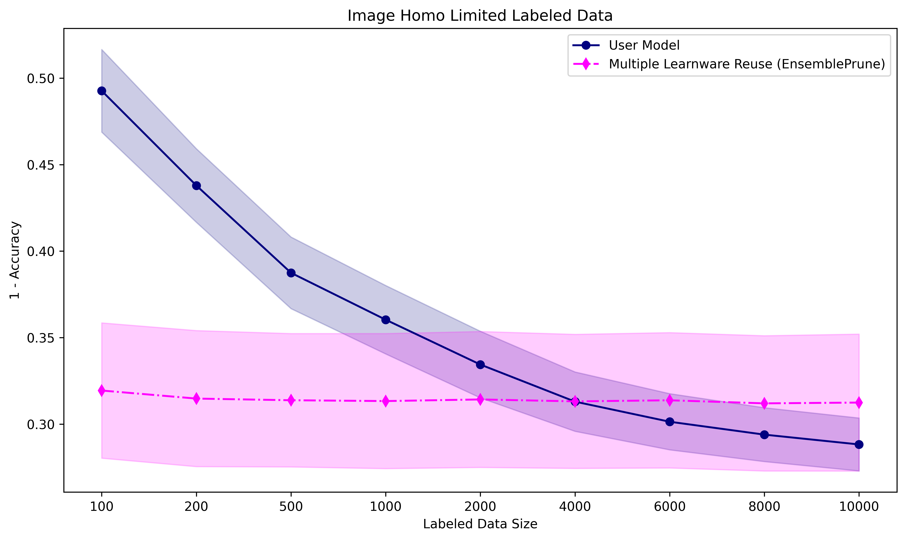

.. _exp:
================================
Experiments and Examples
================================

This chapter will introduce related experiments to illustrate the search and reuse performance of our learnware system.

Environment
====================
For all experiments, we used a single linux server. Details on the specifications are listed in the table below. All processors were used for training and evaluating.

====================  ====================  ===============================
System                GPU                   CPU
====================  ====================  ===============================
Ubuntu 20.04.4 LTS    Nvidia Tesla V100S    Intel(R) Xeon(R) Gold 6240R
====================  ====================  ===============================

Tabular Data Experiments
===========================

Datasets
------------------
Our study involved three public datasets in the sales forecasting field: `Predict Future Sales (PFS) <https://www.kaggle.com/c/competitive-data-science-predict-future-sales/data>`_,
`M5 Forecasting (M5) <https://www.kaggle.com/competitions/m5-forecasting-accuracy/data>`_ and `Corporacion <https://www.kaggle.com/competitions/favorita-grocery-sales-forecasting/data>`_.
We applied various pre-processing methods to these datasets to enhance the richness of the data.
After pre-processing, we first divided each dataset by store and then split the data for each store into training and test sets. Specifically:

- For PFS, the test set consisted of the last month's data from each store.
- For M5, we designated the final 28 days' data from each store as the test set.
- For Corporacion, the test set was composed of the last 16 days of data from each store.

In the submitting stage, the Corporacion dataset's 55 stores are regarded as 165 uploaders, each employing one of three different feature engineering methods. 
For the PFS dataset, 100 uploaders are established, each using one of two feature engineering approaches. 
These uploaders then utilize their respective stores' training data to develop LightGBM models. 
As a result, the learnware market comprises 265 learnwares, derived from five types of feature spaces and two types of label spaces

Based on the specific design of user tasks, our experiments were primarily categorized into two types:

- ``homogeneous experiments`` are designed to evaluate performance when users can reuse learnwares in the learnware market that have the same feature space as their tasks(homogeneous learnwares).
  This contributes to showing the effectiveness of using learnwares that align closely with the user's specific requirements.
   
- ``heterogeneous experiments`` aim to evaluate the performance of identifying and reusing helpful heterogeneous learnwares in situations where 
  no available learnwares match the feature space of the user's task. This helps to highlight the potential of learnwares for applications beyond their original purpose.

Homogeneous Tabular Dataset
-----------------------------

For homogeneous experiments, the 55 stores in the Corporacion dataset act as 55 users, each applying one feature engineering method, 
and using the test data from their respective store as user data. These users can then search for homogeneous learnwares in the market with the same feature spaces as their tasks.

The Mean Squared Error (MSE) of search and reuse is presented in the table below:

+-----------------------------------+---------------------+
| Setting                           |        MSE          |
+===================================+=====================+
| Mean in Market (Single)           |   0.331 ± 0.040     |
+-----------------------------------+---------------------+
| Best in Market (Single)           |   0.151 ± 0.046     |
+-----------------------------------+---------------------+
| Top-1 Reuse (Single)              |   0.280 ± 0.090     |
+-----------------------------------+---------------------+
| Job Selector Reuse (Multiple)     |   0.274 ± 0.064     |
+-----------------------------------+---------------------+
| Average Ensemble Reuse (Multiple) |   0.267 ± 0.051     |
+-----------------------------------+---------------------+

When users have both test data and limited training data derived from their original data, reusing single or multiple searched learnwares from the market can often yield
better results than training models from scratch on limited training data. We present the change curves in MSE for the user's self-trained model, as well as for the Feature Augmentation single learnware reuse method and the Ensemble Pruning multiple learnware reuse method. 
These curves display their performance on the user's test data as the amount of labeled training data increases. 
The average results across 55 users are depicted in the figure below:

.. image:: ../_static/img/table_homo_labeled.png
   :align: center
   :alt: Table Homo Limited Labeled Data

From the figure, it's evident that when users have limited training data, the performance of reusing single/multiple table learnwares is superior to that of the user's own model. 
This emphasizes the benefit of learnware reuse in significantly reducing the need for extensive training data and achieving enhanced results when available user training data is limited.

Heterogeneous Tabular Dataset
------------------------------

In heterogeneous experiments, the learnware market would recommend helpful heterogeneous learnwares with different feature spaces with 
the user tasks. Based on whether there are learnwares in the market that handle tasks similar to the user's task, the experiments can be further subdivided into the following two types:

Cross Feature Space Experiments
^^^^^^^^^^^^^^^^^^^^^^^^^^^^^^^^^^^^^^

We designate the 41 stores in the PFS dataset as users, creating their user data with an alternative feature engineering approach that varies from the methods employed by learnwares in the market. 
Consequently, while the market's learnwares from the PFS dataset undertake tasks very similar to our users, the feature spaces do not match exactly. In this experimental configuration,
we tested various heterogeneous learnware reuse methods (without using user's labeled data) and compared them to the user's self-trained model based on a small amount of training data.
The average MSE performance across 41 users are as follows:

+-----------------------------------+---------------------+
| Setting                           |        MSE          |
+===================================+=====================+
| Mean in Market (Single)           | 1.459 ± 1.066       |
+-----------------------------------+---------------------+
| Best in Market (Single)           | 1.226 ± 1.032       |
+-----------------------------------+---------------------+
| Top-1 Reuse (Single)              | 1.407 ± 1.061       |
+-----------------------------------+---------------------+
| Average Ensemble Reuse (Multiple) | 1.312 ± 1.099       |
+-----------------------------------+---------------------+
| User model with 50 labeled data   | 1.267 ± 1.055       |
+-----------------------------------+---------------------+

From the results, it is noticeable that the learnware market still perform quite well even when users lack labeled data, 
provided it includes learnwares addressing tasks that are similar but not identical to the user's. 
In these instances, the market's effectiveness can match or even rival scenarios where users have access to a limited quantity of labeled data.

Cross Task experiments
^^^^^^^^^^^^^^^^^^^^^^^

Here we have chosen the 10 stores from the M5 dataset to act as users. Although the broad task of sales forecasting is similar to the tasks addressed by the learnwares in the market, 
there are no learnwares available that directly cater to the M5 sales forecasting requirements. All learnwares show variations in both feature and label spaces compared to the tasks of M5 users.
We present the change curves in RMSE for the user's self-trained model and several learnware reuse methods. 
These curves display their performance on the user's test data as the amount of labeled training data increases. 
The average results across 10 users are depicted in the figure below:

.. image:: ../_static/img/table_hetero_labeled.png
   :align: center
   :alt: Table Hetero Limited Labeled Data

We can observe that heterogeneous learnwares are beneficial when there's a limited amount of the user's labeled training data available, 
aiding in better alignment with the user's specific task. This underscores the potential of learnwares to be applied to tasks beyond their original purpose.

Text Data Experiment
==========================

Datasets
------------------
We conducted experiments on the widely used text benchmark dataset: `20-newsgroup <http://qwone.com/~jason/20Newsgroups/>`_.
20-newsgroup is a renowned text classification benchmark with a hierarchical structure, featuring 5 superclasses {comp, rec, sci, talk, misc}.

In the submitting stage, we enumerated all combinations of three superclasses from the five available, randomly sampling 50% of each combination from the training set to create datasets for 50 uploaders.

In the deploying stage, we considered all combinations of two superclasses out of the five, selecting all data for each combination from the testing set as a test dataset for one user. This resulted in 10 users.
The user's own training data was generated using the same sampling procedure as the user test data, despite originating from the training dataset.

Model training comprised two parts: the first part involved training a tfidf feature extractor, and the second part used the extracted text feature vectors to train a naive Bayes classifier.

Our experiments comprises two components:

* ``unlabeled_text_example`` is designed to evaluate performance when users possess only testing data, searching and reusing learnware available in the market.
* ``labeled_text_example`` aims to assess performance when users have both testing and limited training data, searching and reusing learnware directly from the market instead of training a model from scratch. This helps determine the amount of training data saved for the user.

Results
----------------

* ``unlabeled_text_example``:

The accuracy of search and reuse is presented in the table below:

+-----------------------------------+---------------------+
| Setting                           |        Accuracy     |
+===================================+=====================+
| Mean in Market (Single)           | 0.507 ± 0.030       |
+-----------------------------------+---------------------+
| Best in Market (Single)           | 0.859 ± 0.051       |
+-----------------------------------+---------------------+
| Top-1 Reuse (Single)              | 0.846 ± 0.054       |
+-----------------------------------+---------------------+
| Job Selector Reuse (Multiple)     | 0.845 ± 0.053       |
+-----------------------------------+---------------------+
| Average Ensemble Reuse (Multiple) | 0.862 ± 0.051       |
+-----------------------------------+---------------------+

* ``labeled_text_example``:

We present the change curves in classification error rates for both the user's self-trained model and the multiple learnware reuse(EnsemblePrune), showcasing their performance on the user's test data as the user's training data increases. The average results across 10 users are depicted below:

From the figure above, it is evident that when the user's own training data is limited, the performance of multiple learnware reuse surpasses that of the user's own model. As the user's training data grows, it is expected that the user's model will eventually outperform the learnware reuse. This underscores the value of reusing learnware to significantly conserve training data and achieve superior performance when user training data is limited.

Image Data Experiment
=========================

For the CIFAR-10 dataset, we sampled the training set unevenly by category and constructed unbalanced training datasets for the 50 learnwares that contained only some of the categories. This makes it unlikely that there exists any learnware in the learnware market that can accurately handle all categories of data; only the learnware whose training data is closest to the data distribution of the target task is likely to perform well on the target task. Specifically, the probability of each category being sampled obeys a random multinomial distribution, with a non-zero probability of sampling on only 4 categories, and the sampling ratio is 0.4: 0.4: 0.1: 0.1. Ultimately, the training set for each learnware contains 12,000 samples covering the data of 4 categories in CIFAR-10.

We constructed 50 target tasks using data from the test set of CIFAR-10. Similar to constructing the training set for the learnwares, in order to allow for some variation between tasks, we sampled the test set unevenly. Specifically, the probability of each category being sampled obeys a random multinomial distribution, with non-zero sampling probability on 6 categories, and the sampling ratio is 0.3: 0.3: 0.1: 0.1: 0.1: 0.1. Ultimately, each target task contains 3000 samples covering the data of 6 categories in CIFAR-10.

With this experimental setup, we evaluated the performance of RKME Image using 1 - Accuracy as the loss.

+-----------------------------------+---------------------+
| Setting                           |        Accuracy     |
+===================================+=====================+
| Mean in Market (Single)           | 0.655 ± 0.021       |
+-----------------------------------+---------------------+
| Best in Market (Single)           | 0.304 ± 0.046       |
+-----------------------------------+---------------------+
| Top-1 Reuse (Single)              | 0.406 ± 0.128       |
+-----------------------------------+---------------------+
| Job Selector Reuse (Multiple)     | 0.406 ± 0.128       |
+-----------------------------------+---------------------+
| Average Ensemble Reuse (Multiple) | 0.310 ± 0.112       |
+-----------------------------------+---------------------+

In some specific settings, the user will have a small number of labelled samples. In such settings, learning the weight of selected learnwares on a limited number of labelled samples can result in a better performance than training directly on a limited number of labelled samples.

Get Start Examples
=========================
Examples for `Tabular, Text` and `Image` data sets are available at `Learnware Examples <https://github.com/Learnware-LAMDA/Learnware/tree/main/examples>`_. You can run { main.py } directly to reproduce related experiments.
We utilize the `fire` module to construct our experiments.

Tabular Examples
------------------
You can execute the experiment with the following commands:

* `python main.py unlabeled_text_example`: Executes the unlabeled_text_example experiment; the results will be printed in the terminal.
* `python main.py labeled_text_example`: Executes the labeled_text_example experiment; result curves will be automatically saved in the `figs` directory.
