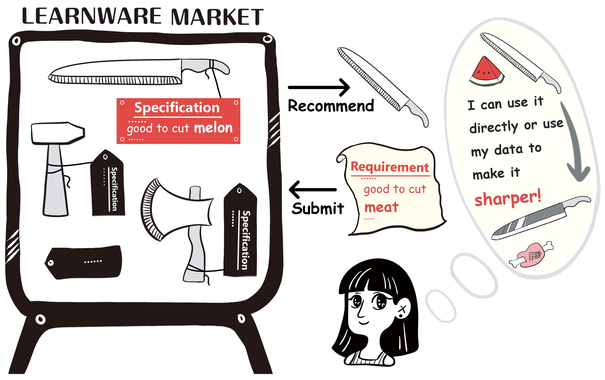

.. _intro:
================
Introduction
================

The learnware paradigm attempts to help the user reuse existed well-trained models to solve their problems instead of starting from scratch. The ``Learnware`` package offers a fundamental implementation of the central concepts and procedures for the learnware paradigm.

The ``Learnware`` packag effectively organizes related concepts and core functionalities of the learnware paradigm while maintaining high scalability. This design enables effortless integration of various new features and techniques in the future.

The ``Learnware`` package serves as the engine for the `Beimingwu System <https://bmwu.cloud/#/>`_ and can also be utilized for experiments related to learnware.

What is Learnware ?
================

A learnware consists of high-performance machine learning models and specifications that characterize the models, i.e., "Learnware = Model + Specification."

The learnware specification consists of "semantic specification" and "statistical specification":

- semantic specification describes the type and functionality of the model through text.
- statistical specification characterizes the statistical information contained in the model using various machine learning techniques.

Learnware specifications describe the model's capabilities, enabling the model to be identified and reused by future users who may know nothing about the learnware in advance.

Why do we need Learnware ?
================

The Benefits of Learnware Paradigm
-----------------

Machine learning has achieved great success in many fields but still faces various challenges, such as the need for extensive training data and advanced training techniques, the difficulty of continuous learning, the risk of catastrophic forgetting, and the leakage of data privacy.

Although there are many efforts focusing on one of these issues separately, they are entangled, and solving one problem may exacerbate others. The learnware paradigm aimss to address many of these challenges through a unified framework.

+-----------------------+-----------------------------------------------------------------------------------------------+
| Benefit               | Description                                                                                   |
+=======================+===============================================================================================+
| Lack of training data | Strong models can be built with small data by adapting well-performed learnwares.             |
+-----------------------+-----------------------------------------------------------------------------------------------+
| Lack of training      | Ordinary users can obtain strong models by leveraging well-performed learnwares instead of    |
| skills                | building models from scratch.                                                                 |
+-----------------------+-----------------------------------------------------------------------------------------------+
| Catastrophic          | Accepted learnwares are always stored in the learnware market, retaining old knowledge.       |
| forgetting            |                                                                                               |
+-----------------------+-----------------------------------------------------------------------------------------------+
| Continual learning    | The learnware market continually enriches its knowledge with constant submissions of          |
|                       | well-performed learnwares.                                                                    |
+-----------------------+-----------------------------------------------------------------------------------------------+
| Data privacy/         | Developers only submit models, not data, preserving data privacy/proprietary.                 |
| proprietary           |                                                                                               |
+-----------------------+-----------------------------------------------------------------------------------------------+
| Unplanned tasks       | Open to all legal developers, the learnware market can accommodate helpful learnwares for     |
|                       | various tasks.                                                                                |
+-----------------------+-----------------------------------------------------------------------------------------------+
| Carbon emission       | Assembling small models may offer good-enough performance, reducing interest in training      |
|                       | large models and the carbon footprint.                                                        |
+-----------------------+-----------------------------------------------------------------------------------------------+

How to Solve Future Tasks with Learnware Paradigm?
--------------

Instead of building a model from scratch, users can submit their requirements to the learnware market, which then identifies and deploys helpful learnware(s) based on the specifications. Users can apply the learnware directly, adapt it using their data, or exploit it in other ways to improve their model. This process is more efficient and less expensive than building a model from scratch.

Procedure of Learnware Paradigm
================
- **Submitting Stage**: Developers voluntarily submit various learnwares to the learnware dock system, and the system conducts quality checks and further organization of these learnwares.
- **Deploying Stage**: When users submit task requirements, the learnware dock system automatically selects whether to recommend a single learnware or a combination of multiple learnwares and provides efficient deployment methods. Whether it's a single learnware or a combination of multiple learnwares, the system offers convenient learnware reuse interfaces.

.. image:: ../_static/img/learnware_market.svg
   :align: center

Learnware Package Design
================

TBD by xiaodong.
